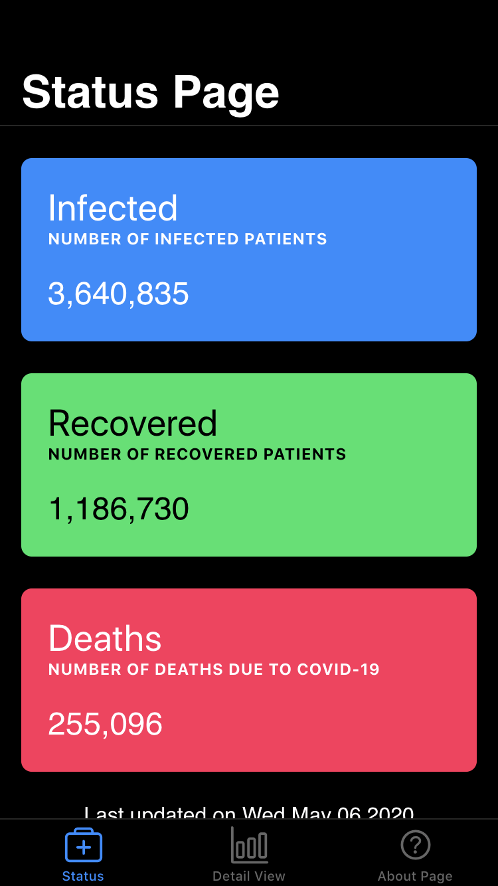

# COVID-19 Tracker App
## Ionic (Angular/Typescript) Based App for tracking 

### How to work with it?
1. Clone the repository with `git clone https://github.com/aurghya-0/covid-19-tracker-ionic`.
2. `cd` into the project folder and run `npm install`. You have to have NodeJS installed in your pc.

**If you want to continue development on this project**
- Install ionic framwork globally following the guidelines of http://ionicframework.com
- Run `ionic serve` to run a development server.

**If you want to test this app on android**
- Open the `android` folder with android studio. (Or use `ionic cap open android`)
- Run/build the project.